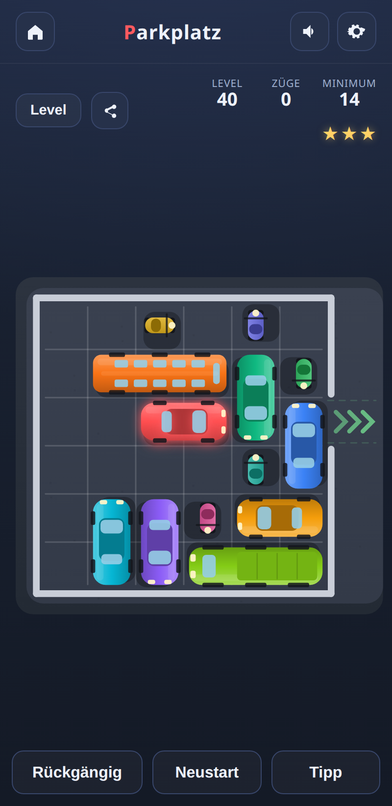
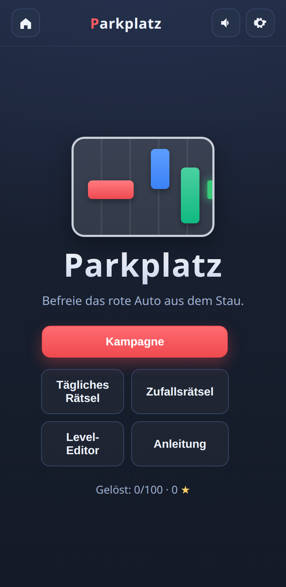
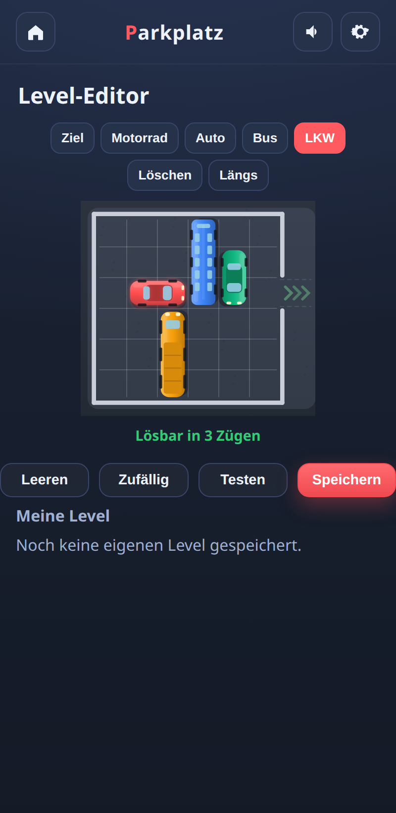

# Parkplatz 🚗

A sliding-block traffic puzzle in the spirit of *Rush Hour*, built as a single
self-contained HTML5 game. Clear a path for the red car so it can drive out of
the crowded parking lot. **100 hand-verified puzzles** across four difficulty
tiers, plus a level editor, a daily challenge, random puzzles, themes, sound and
music — all offline and installable as an app.

**No build step, no dependencies, no internet.** Just open `index.html`.

<p align="center">
  
</p>
<p align="center">
  
  &nbsp;&nbsp;
  
</p>

## ▶️ Play online

**→ [https://laserrapt0r.github.io/Parkplatz/](https://laserrapt0r.github.io/Parkplatz/)**

The game is deployed automatically to GitHub Pages on every push to `main`
(see [`.github/workflows/deploy-pages.yml`](.github/workflows/deploy-pages.yml)).

## 📱 Install as an app (PWA)

Parkplatz is a Progressive Web App. Open it in a browser and choose
**“Install”/“Add to Home Screen”** (or use the in-game **Install** button when
your browser offers it). It then runs full-screen and works completely offline,
thanks to a service worker that caches the whole game.

---

## Features

### Game modes
- **Campaign** — 100 unique puzzles across four tiers (*Easy · Medium · Hard ·
  Very hard*). None trivial; difficulty ramps smoothly from 6 to 33 minimum moves.
- **Daily puzzle** — a fresh, deterministic puzzle generated from the date, the
  same for everyone on a given day.
- **Random puzzle** — generate a fresh puzzle in the browser at your chosen
  difficulty.
- **Level editor** — build your own puzzles. The layout is checked live: the
  editor tells you whether it is solvable and in how many moves (computed by a
  built-in BFS solver). Save, replay and delete your creations.

### Puzzle quality
- **Provably minimal solutions.** Every campaign puzzle's minimum move count was
  computed by an exhaustive breadth-first search over the whole reachable state
  graph and independently re-verified. Every puzzle is guaranteed solvable.
- **Three-star rating.** Match the theoretical minimum to earn all three stars —
  the stars show how close you got to a perfect run.
- **Star gating** (optional) — unlock harder tiers by collecting stars.

### Presentation
- **Four vehicle types:** motorcycles, cars, buses and trucks, each rendered in a
  distinct top-down style.
- **Themes:** Day, Night and Neon.
- **Smooth animations:** eased sliding, a drive-out sequence, pulsing exit
  chevrons, animated star rewards and win **confetti**.
- **Synthesized audio:** sound effects *and* an optional generative background
  music loop via the Web Audio API — no audio files, works fully offline.

### Accessibility & options
- **Colorblind mode** — adds distinct patterns to vehicles on top of color.
- **Reduced motion** — respects `prefers-reduced-motion` (Auto/Reduced/Full).
- **12 languages:** German, English, Spanish, French, Italian, Portuguese,
  Dutch, Polish, Simplified & Traditional Chinese, Japanese and Arabic (with
  full right-to-left layout) — auto-detected and switchable any time.
- **Settings screen:** language, SFX & music volume, theme, colorblind, motion,
  star gating and a progress reset.

### Controls
- **Mouse / touch:** grab a vehicle and slide it along its lane.
- **Keyboard:** <kbd>Tab</kbd> selects a vehicle, arrow keys slide it (a run of
  moves in one direction counts as a single move, just like one mouse drag).

### Other
- **Progress saved** in your browser (`localStorage`): stars, best moves,
  settings, daily results and custom levels.
- **Shareable links:** an in-game **Share** button copies (or shares, via the
  Web Share API) a deep link to the current level. Campaign levels use
  `?level=42`; `?daily` and `?random=schwer` also work.
- **Undo**, **Restart** and an optimal-move **Hint** (solved live in the browser).

---

## How to play

1. Open `index.html` in any modern browser (Chrome, Firefox, Edge, Safari) — or
   just visit the [online version](https://laserrapt0r.github.io/Parkplatz/).
2. Pick a mode from the menu (**Campaign**, **Daily**, **Random** or **Editor**).
3. Drag vehicles. Each vehicle only moves along its own axis and cannot pass
   through or overlap another.
4. Free the **red car** and slide it out through the exit gap on the right.
5. Solve it in as few moves as possible — matching the minimum earns 3 stars.

### Difficulty tiers

Difficulty is measured by the minimum number of moves (a *move* = sliding one
vehicle any distance in a single direction — the classic Rush Hour convention).

| Tier       | Levels | Typical minimum moves |
|------------|--------|-----------------------|
| Easy       | 1–25   | ~6–10                 |
| Medium     | 26–50  | ~10–16                |
| Hard       | 51–75  | ~17–22                |
| Very hard  | 76–100 | ~22–33                |

### Star rating

- ⭐⭐⭐ — solved in the minimum number of moves (a perfect run)
- ⭐⭐ — a little over the minimum
- ⭐ — solved, but well over the minimum

---

## Project structure

```
Parkplatz/
├── index.html                     # Game shell / markup
├── manifest.webmanifest           # PWA manifest
├── sw.js                          # Service worker (offline cache)
├── css/
│   └── style.css                  # Styling, themes and animations
├── icons/                         # App icons (SVG + generated PNGs)
├── js/
│   ├── puzzles-data.js            # The 100 generated puzzles (auto-generated)
│   ├── i18n.js                    # German / English strings
│   ├── storage.js                # Progress & settings (localStorage)
│   ├── audio.js                  # Web Audio sound effects + music
│   ├── solver.js                 # In-browser BFS solver (hints & editor)
│   ├── puzzlegen.js              # In-browser generator (random & daily)
│   └── game.js                   # Rendering, input, game flow
├── tools/
│   ├── generate.js               # Puzzle generator + BFS minimum-move solver
│   └── verify.js                 # Independent solvability / minimum verifier
├── .github/workflows/
│   └── deploy-pages.yml          # GitHub Pages deployment
├── .gitignore
└── README.md
```

---

## Regenerating the puzzles

The puzzles are pre-generated and committed in `js/puzzles-data.js`, so you never
need to run the generator to play. To create a fresh set:

```bash
node tools/generate.js   # writes js/puzzles-data.js (deterministic, seeded)
node tools/verify.js     # re-solves all 100 puzzles to confirm correctness
```

The generator *harvests whole state graphs*: it builds a set of vehicles,
enumerates every reachable arrangement, and — because sliding moves are
reversible — runs a multi-source BFS from the solved arrangements to obtain the
exact minimum move count for every arrangement at once. It then selects 100
puzzles along a smooth difficulty curve. A fixed random seed makes the output
reproducible. Requires Node.js (no npm packages).

---

## Tech

Vanilla JavaScript, HTML5 Canvas, the Web Audio API and a service worker. No
frameworks, no external assets, no network requests — the whole game runs from
the local files.

## License

MIT.

```
MIT License

Copyright (c) 2026

Permission is hereby granted, free of charge, to any person obtaining a copy
of this software and associated documentation files (the "Software"), to deal
in the Software without restriction, including without limitation the rights
to use, copy, modify, merge, publish, distribute, sublicense, and/or sell
copies of the Software, and to permit persons to whom the Software is
furnished to do so, subject to the following conditions:

The above copyright notice and this permission notice shall be included in all
copies or substantial portions of the Software.

THE SOFTWARE IS PROVIDED "AS IS", WITHOUT WARRANTY OF ANY KIND, EXPRESS OR
IMPLIED, INCLUDING BUT NOT LIMITED TO THE WARRANTIES OF MERCHANTABILITY,
FITNESS FOR A PARTICULAR PURPOSE AND NONINFRINGEMENT. IN NO EVENT SHALL THE
AUTHORS OR COPYRIGHT HOLDERS BE LIABLE FOR ANY CLAIM, DAMAGES OR OTHER
LIABILITY, WHETHER IN AN ACTION OF CONTRACT, TORT OR OTHERWISE, ARISING FROM,
OUT OF OR IN CONNECTION WITH THE SOFTWARE OR THE USE OR OTHER DEALINGS IN THE
SOFTWARE.
```
